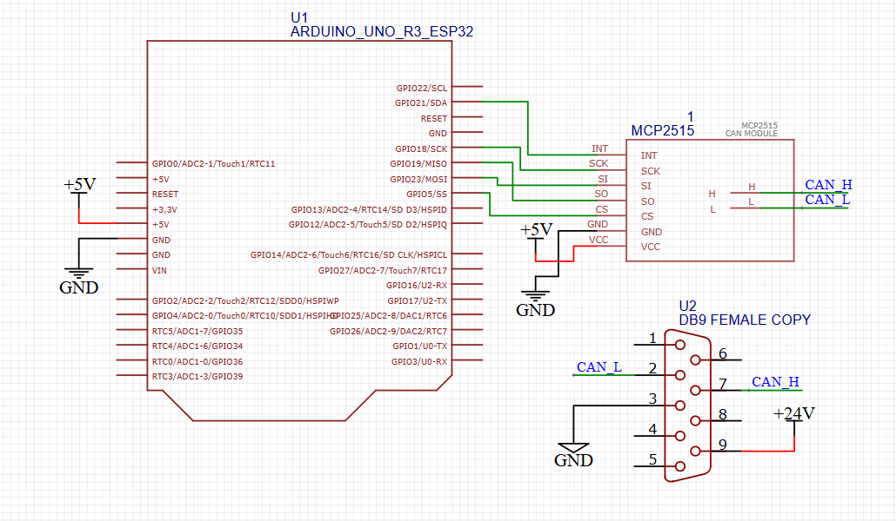

# Eclimo CAN bus monitor

> [!IMPORTANT]
> Change WiFi name & password + Add database URL
> ```
> #define WIFI_SSID "YOUR_WIFI_NAME"
> #define WIFI_PASSWORD "YOUR_WIFI_PASSWORD"
>
> #define DATABASE_URL "YOUR_DATABASE_URL"
>  ```
> ## Electronics
> - ESP32
> - MCP2515 CAN bus module
> 
>Refer to [Schematics](https://github.com/KhohZongEu/Eclimo-CAN-bus-monitor/tree/main?tab=readme-ov-file#schematics) for wiring

### Implemented functions
- Wifi Connectivity
- Reading canbus data
- Sending data to [FirebaseRTDB](https://firebase.google.com/products/realtime-database)

Functions are separated for easier pinpointing and debugging. 

### Firebase Data Format
Current data is stored as an array and has to be placed in a `string` as shown below:
```
[1,2,3,4,5]
```
Which is converted using the `formatData()` that returns a `string`.

## Libraries
Refer to original documentation created by the developers of libraries used.

### Used Libraries
1. [MCP_CAN_lib](https://github.com/coryjfowler/MCP_CAN_lib) by coryjfowler
2. [FirebaseClient](https://github.com/mobizt/FirebaseClient) by mobizt

### Schematics

